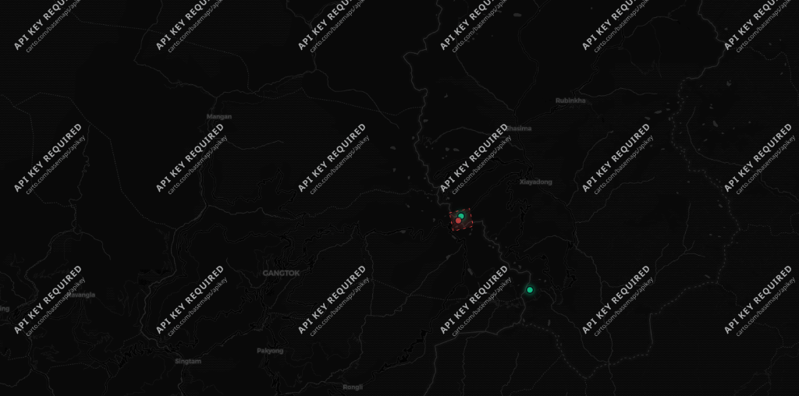
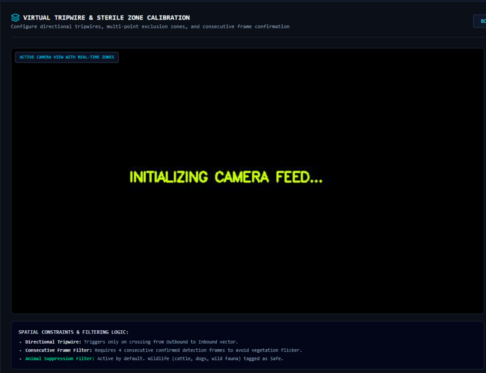
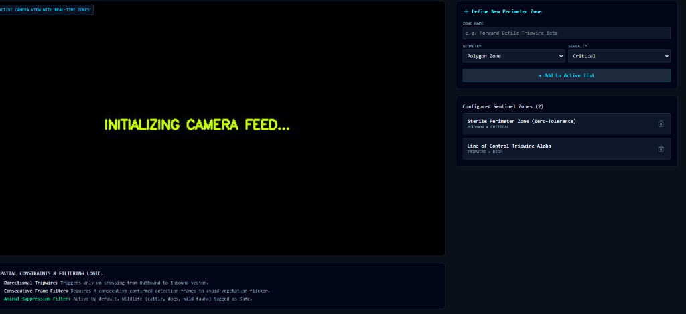
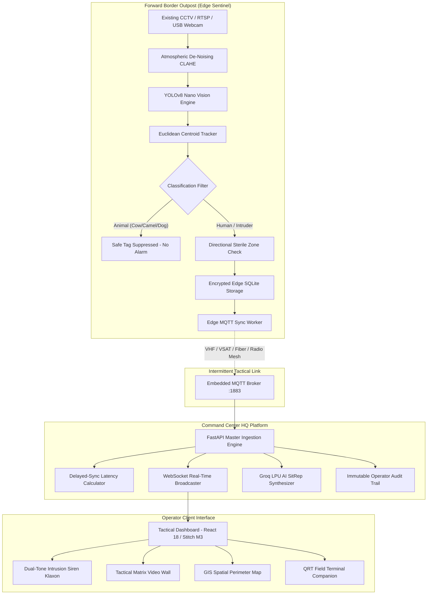

# 🛡️ RAKSHA AI 2.0 (रक्षा AI)
### **AI-Based Intelligent Video Analytics Platform for Border Surveillance using Existing CCTV Infrastructure**

<div align="center">


[](https://sih.gov.in/)
[](https://sih.gov.in/)
[-orange.svg?style=for-the-badge)](https://www.mha.gov.in/)
[]()
[](https://python.org)
[](https://ultralytics.com)
[]()
[](LICENSE)

**A 100% software-only, camera-agnostic, edge-first AI retrofit platform for forward Border Outposts (BOPs) of India's Border Security Forces (BSF, ITBP, SSB, Assam Rifles).**

[Live Features](#-key-capabilities) • [System Architecture](#-system-architecture) • [Quick Start](#-quick-start-in-under-2-minutes) • [Demo Walkthrough](#-hackathon-demo-walkthrough) • [API Reference](#-api-endpoints)

</div>

---

## 📸 Tactical Interface Preview

<div align="center">

### **BSF Sentinel-AI Command Center Dashboard (Google Stitch Theme)**


*Real-Time Tactical Video Wall Matrix with Sub-millisecond Zulu Mission Clock, Multi-Outpost Filters, Directional Tripwires, and Live Incursion Incident Stream.*

</div>

<br/>

<div align="center">
<table>
  <tr>
    <td width="50%" align="center">
      <b>LWIR Thermal Incursion Tracking & Reticle HUD</b><br/><br/>
      
    </td>
    <td width="50%" align="center">
      <b>Live Bounding Reticle & Sterile Zone Geometry</b><br/><br/>
      
    </td>
  </tr>
</table>
</div>

---

## 📌 Problem Statement & Operational Challenge (SIH26187)

India shares over **15,000 km of international land borders** across rugged mountain passes (Sikkim/Ladakh), dense riverine marshlands (Assam/Kutch), and arid desert frontiers (Thar). While thousands of CCTV cameras exist under initiatives like **CIBMS** and **BOLD-QIT**, they operate primarily as **passive video recorders**.

```
  TRADITIONAL CCTV CHALLENGES                  RAKSHA AI 2.0 SOLUTION
┌──────────────────────────────────────┐     ┌──────────────────────────────────────┐
│ Sentry visual fatigue (>70% drop)    │ ──> │ Real-Time Autonomous Edge Detection  │
│ Alarm fatigue (wildlife / wind)      │ ──> │ AI Animal False-Positive Suppression │
│ Intermittent / Zero frontier comms   │ ──> │ Offline SQLite Store & Forward (MQTT)│
│ Dense fog, haze & dust storms        │ ──> │ CLAHE Atmospheric De-Noising Pipeline│
│ Proprietary smart camera cost ($$$$) │ ──> │ 100% Software-Only CCTV Retrofit     │
└──────────────────────────────────────┘     └──────────────────────────────────────┘
```

---

## ⚡ Key Capabilities

### 1. 🎯 **Camera-Agnostic Software Retrofit**
- Plugs directly into any existing analog CCTV (via DVR/NVR), IP RTSP stream, pre-recorded video file, or USB webcam.
- **Zero hardware overhaul required** — saves public funds while instantly modernizing forward BOPs.

### 2. 🦙 **Zero-Fatigue Wildlife Suppression**
- Distinguishes between critical tactical threats (`person`, `vehicle`, `drone`) and harmless border wildlife (`cow`, `camel`, `dog`, `sheep`, `horse`, `birds`).
- Suppressed animals are marked in safe emerald-green tags (`Safe — Animal, Suppressed`) without triggering sirens or alerting sentries.

### 3. 🚨 **Dual-Tone Military Incursion Siren & Klaxon**
- Synthesizes authentic dual-tone perimeter intrusion klaxons (920Hz ⟷ 580Hz warble) using the Web Audio API.
- **Audible and visual alarms trigger ONLY for human intrusions** in sterile zones.
- Includes 1-tap **QRT Dispatch**, **Siren Silence**, and **Arm/Mute** controls.

### 4. 📦 **Atmanirbhar Offline Store-and-Forward (Zero Alert Loss)**
- All incursion metadata and video snapshot evidence are committed to an **encrypted local SQLite database on the edge first**.
- A resilient MQTT sync worker monitors tactical connectivity (VHF/UHF, satellite, fiber) and flushes queued alerts when the link restores.
- HQ dashboard displays delayed-sync latency tags (*"Synced 2.5 min late"*), proving offline resilience.

### 5. 🌫️ **All-Weather Atmospheric De-Fogging (CLAHE Pipeline)**
- Real-time contrast-limited adaptive histogram equalization in LAB color space.
- Penetrates dense high-altitude fog (Nathu La) and desert dust storms (Thar) to uncover camouflaged crawlers.

### 6. 🤖 **Tactical LLM Copilot & Automated SitRep (Groq LPU)**
- Synthesizes instant natural language Situation Reports (SitRep) including threat assessment, Rules of Engagement (ROE), terrain analysis, and recommended QRT dispatch.
- Responds in sub-100ms via ultra-low latency Groq LPUs.

### 7. 🔒 **Privacy-First (No Facial Recognition)**
- In accordance with defense standards, Raksha AI uses tactical object classification instead of biometric facial scanning, ensuring compliance and utility across 50m–500m optical ranges.

---

## 🏗️ System Architecture



---

## 📁 Repository Structure

```text
raksha_ai_2.0/
├── backend/                  # Command Center HQ Platform (FastAPI)
│   ├── main.py               # REST endpoints, WebSockets, static file server
│   ├── mqtt_subscriber.py    # Multi-BOP stream subscriber & delayed-sync calculator
│   ├── ai_copilot.py         # Groq LLM tactical copilot & SitRep generator
│   └── storage.py            # Master incident database & immutable audit trail
├── edge/                     # Edge Sentinel AI Processing Unit
│   ├── edge_service.py       # Multi-camera ingestion & main detection loop
│   ├── detector.py           # YOLOv8 nano engine + native centroid tracker
│   ├── animal_filter.py      # Wildlife suppression & alert-fatigue filter
│   ├── zone_analytics.py     # Virtual tripwires & multi-point polygon sterile zones
│   ├── fog_enhancer.py       # LAB-space CLAHE atmospheric de-noising
│   ├── storage.py            # Local encrypted SQLite store-and-forward engine
│   └── mqtt_sync.py          # Background network sync worker with auto-retry
├── broker/                   # Standalone Embedded MQTT Message Broker
│   └── embedded_broker.py    # Zero-dependency asyncio MQTT broker (:1883)
├── frontend/                 # Tactical Web Interface (React 18 + Vite + Tailwind)
│   ├── src/
│   │   ├── components/       # Google Stitch M3 tactical components
│   │   │   ├── CameraGrid.jsx       # Tactical matrix video wall & webcam switcher
│   │   │   ├── LiveAlertFeed.jsx    # Real-time incident stream with delayed sync
│   │   │   ├── AlertDetailModal.jsx # Forensic dossier & AI SitRep generator
│   │   │   ├── ZoneConfigView.jsx   # Interactive polygon tripwire calibration
│   │   │   ├── AICopilotView.jsx    # Groq LPU natural language tactical assistant
│   │   │   ├── AnalyticsView.jsx    # 24hr incursion analytics & MTTA KPIs
│   │   │   ├── MobilePatrolView.jsx # High-contrast 1-tap QRT patrol terminal
│   │   │   ├── AuditTrailView.jsx   # Non-repudiable operator action audit log
│   │   │   ├── TacticalMap.jsx      # GIS spatial map with real-time sector pins
│   │   │   └── Navbar.jsx           # Zulu clock, DEFCON badge & klaxon controls
│   │   ├── utils/
│   │   │   └── alarmSystem.js       # Dual-tone Web Audio API military siren synthesizer
│   │   └── App.jsx                  # Main command center layout & alert router
├── demo_assets/              # Synthetic multi-sector border surveillance feeds
├── docs/assets/              # High-resolution architectural graphics & UI previews
├── run_all.py                # 1-Click launcher (Broker + HQ + Edge + UI)
├── requirements.txt          # Python dependencies
└── README.md                 # Project documentation
```

---

## 🚀 Quick Start (in under 2 minutes)

### 1. Prerequisites
- **Python:** 3.10, 3.11, 3.12, or 3.13
- **Node.js:** 18+ (Optional; pre-built frontend is included)
- **Webcam:** Any built-in or USB webcam (optional, video fallback included)

### 2. Clone Repository
```bash
git clone https://github.com/kavya0704/raksha2.0.git
cd raksha2.0
```

### 3. Install Dependencies
```bash
pip install -r requirements.txt
```
*(Or install directly: `pip install ultralytics paho-mqtt cryptography pillow python-multipart fastapi uvicorn requests`)*

### 4. Launch Raksha AI 2.0 (1-Click)
```bash
python run_all.py
```

This single command automatically starts:
1. **Embedded MQTT Broker** on `0.0.0.0:1883`
2. **Command Center HQ Backend** on `http://127.0.0.1:8000`
3. **Edge Sentinel Vision Unit** (with live webcam support on CAM-01)
4. **Launches your default browser** directly into the tactical command dashboard.

---

## 🎮 Hackathon Demo Walkthrough

### 🎬 Scenario 1: Live Webcam Sentinel & Audible Siren
1. In the **Tactical Matrix Wall**, navigate to **CAM-01 (BOP Nathu La)**.
2. Click the **`📷 WEBCAM`** button to switch CAM-01 to your live laptop camera.
3. Stand in front of the camera:
   - YOLOv8 instantly detects you as a **`PERSON`**.
   - The **Dual-Tone Military Siren Klaxon** sounds through your speakers.
   - The top banner flashes **`🚨 CRITICAL INCURSION DETECTED // PERSON BREACH AT CAM-01`**.
   - Click **`1-TAP QRT DISPATCH`** or **`SILENCE SIREN`** to acknowledge.

### 🎬 Scenario 2: Animal False-Positive Suppression
1. Look at the other cameras or show an image/toy of a **cow, camel, dog, or sheep**.
2. YOLOv8 recognizes the wildlife and tags it in **emerald-green**: `"Safe — Animal (Cow), Suppressed"`.
3. **No audible siren is sounded and no false alarms are created**, eliminating sentry fatigue.

### 🎬 Scenario 3: Offline Store-and-Forward Resilience
1. Even if network connection to HQ drops, the Edge Unit continues logging detections locally in encrypted SQLite.
2. When the link reconnects, all queued alerts are transmitted in sequence with a **`Delayed Sync`** badge.

### 🎬 Scenario 4: All-Weather Fog Enhancement (CLAHE)
1. On **CAM-02 (Ridge Defile)** or **CAM-03 (Valley)**, click the **`DE-FOG`** button.
2. Watch the image instantly sharpen and increase contrast, revealing hidden objects in dense mist.

---

## 📡 API Endpoints

| Method | Endpoint | Description |
|---|---|---|
| `GET` | `/api/cameras` | Returns all active cameras, FPS, and status |
| `GET` | `/api/cameras/{id}/stream` | MJPEG real-time video stream |
| `POST`| `/api/cameras/{id}/source` | Switch between live webcam and demo source |
| `POST`| `/api/cameras/{id}/fog-enhancer` | Toggle CLAHE atmospheric de-noising |
| `GET` | `/api/alerts` | Retrieve all pending & resolved incursion alerts |
| `POST`| `/api/alerts/{id}/action` | Log sentry action (Ack, Escalate, False Alarm, QRT) |
| `POST`| `/api/ai/sitrep` | Generate instant Groq LPU Situation Report |
| `POST`| `/api/ai/chat` | Natural language tactical copilot chat |
| `WS`  | `/ws` | Real-time WebSocket feed for live incursion alerts |

---

## 👥 Smart India Hackathon 2026 Team

- **Problem Statement:** SIH26187 (Ministry of Home Affairs)
- **Project Title:** RAKSHA AI 2.0 (रक्षा AI)
- **Theme:** Smart Automation / Frontier Border Defense

---

## 📄 License
This project is licensed under the MIT License — see the [LICENSE](LICENSE) file for details.
